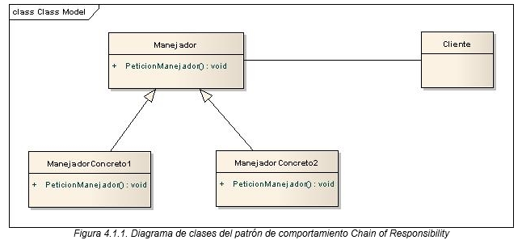

# Patrón de Diseño: Chain of Responsibility

El patrón **Cadena de Responsabilidad** es un patrón de comportamiento que permite pasar una solicitud a través de una cadena de manejadores. Cada manejador decide si procesa la solicitud o la pasa al siguiente en la cadena. Este patrón se usa cuando varias entidades pueden manejar una solicitud, pero el proceso específico que se utilizará depende de su responsabilidad en la cadena.

## Objetivo

El objetivo del patrón Cadena de Responsabilidad es desacoplar el emisor de una solicitud de sus receptores, al dar la oportunidad de más de un objeto de manejar la solicitud. Con esto, se mejora la flexibilidad al agregar o cambiar los manejadores en tiempo de ejecución sin afectar al emisor.

## Diagrama de clases


## Estructura
1. **Handler**: Interfaz o clase abstracta que define el método para manejar una solicitud y enlazar el siguiente manejador en la cadena.
2. **ConcreteHandlers**: Clases concretas que implementan `Handler` y realizan las verificaciones necesarias para cada solicitud.
3. **Client**: Clase que configura la cadena de manejadores y envía la solicitud para su procesamiento.

## Ejecución
Para ejecutar el proyecto, asegúrate de tener configurado Maven y ejecuta los siguientes comandos:
```bash
    mvn clean install
    mvn exec:java
