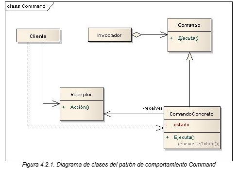

# Patrón de Diseño: Command

Este proyecto demuestra la implementación del patrón de diseño **Command**. El patrón Command encapsula una solicitud como un objeto, lo que permite parametrizar clientes con diferentes solicitudes, encolar o registrar solicitudes y soportar operaciones que pueden deshacerse.

## Objetivo

El objetivo del patrón Command es desacoplar el objeto que invoca una operación de los objetos que realizan la operación. Este patrón permite:

- Ejecutar operaciones de forma asíncrona o en diferentes momentos.
- Almacenar y ejecutar una secuencia de operaciones.
- Deshacer operaciones previamente ejecutadas (con un historial de comandos).

## Diagrama de clases


## Estructura
1. **Command**: Interfaz base para todos los comandos. Define el método `execute()` para ejecutar el comando.
2. **ConcreteCommand**: Implementaciones específicas de comandos que encapsulan una solicitud hacia el receptor.
3. **Receiver**: El objeto que realiza la acción real. Cada comando delega al receptor el trabajo específico.
4. **Invoker**: Objeto que almacena comandos y los ejecuta bajo demanda.
5. **Client**: Configura y establece las relaciones entre los comandos, los receptores y el invocador.

## Ejecución
Para ejecutar el proyecto, asegúrate de tener configurado Maven y ejecuta los siguientes comandos:
```bash
    mvn clean install
    mvn exec:java
