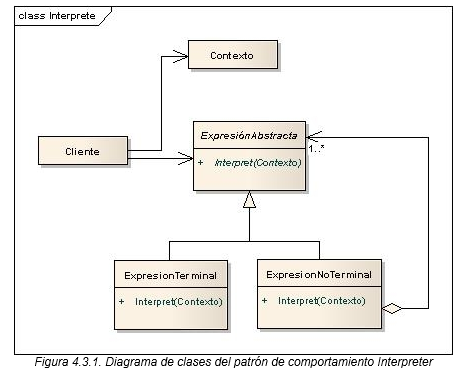

# Patrón de Diseño: Interpreter
Este proyecto demuestra la implementación del patrón de diseño **Interpreter**. El patrón Interpreter define una representación para la gramática de un lenguaje y utiliza un intérprete para evaluar las expresiones en este lenguaje. En este caso, el ejemplo implementa un intérprete para resolver expresiones matemáticas en notación postfija (RPN).

## Objetivo

El objetivo del patrón Interpreter es proporcionar una manera de interpretar o evaluar expresiones, creando una jerarquía de clases que representan las distintas reglas de la gramática. Este patrón permite:

- Evaluar expresiones complejas a través de la combinación de expresiones simples.
- Implementar lenguajes específicos para resolver problemas repetitivos de interpretación.
- Facilitar la extensión de la gramática agregando nuevos tipos de expresiones.

## Diagrama de clases


## Estructura
1. **AbstractExpression**: Clase base para todas las expresiones en la gramática, con un método interpret() que cada expresión concreta implementa.
2. **TerminalExpression**: Expresión que representa un número en la expresión postfija. Interpreta valores numéricos específicos.
3. **NonTerminalExpression**: Expresión que representa un operador (+, -, *, /) y que interpreta combinaciones de otras expresiones.
4. **Context**: Contexto que contiene la información global necesaria para evaluar las expresiones.

## Ejecución
Para ejecutar el proyecto, asegúrate de tener configurado Maven y ejecuta los siguientes comandos:
```bash
    mvn clean install
    mvn exec:java
