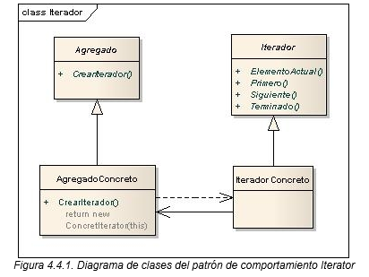

# Patrón de Diseño: Iterator

## Objetivo


## Diagrama de clases


## Estructura

## Ejecución
Para ejecutar el proyecto, asegúrate de tener configurado Maven y ejecuta los siguientes comandos:
```bash
    mvn clean install
    mvn exec:java
