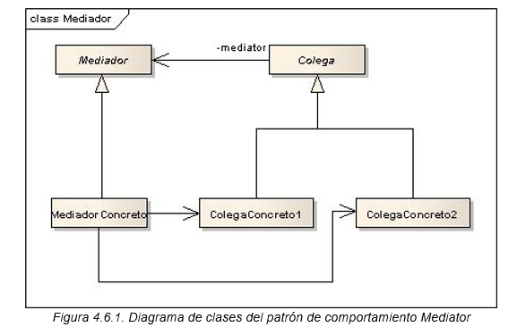

# Patrón de Diseño: Mediator
Este proyecto demuestra la implementación del patrón de diseño **Mediator**. El patrón Mediator define un objeto intermediario que encapsula la forma en que interactúan un conjunto de objetos. Este patrón promueve el acoplamiento débil al prevenir que los objetos se refieran unos a otros directamente y permite variar sus interacciones de manera independiente.

## Objetivo
El objetivo del patrón Mediator es coordinar la interacción entre objetos para reducir las dependencias directas entre ellos. Este patrón permite:

- Desacoplar las interacciones entre objetos colaborativos.
- Facilitar la comunicación en sistemas complejos mediante un mediador central.
- Controlar y centralizar la lógica de interacción entre múltiples objetos.

## Diagrama de clases


## Estructura
1. **Mediator**: Interfaz que declara los métodos para la comunicación entre objetos (colegas).
2. **ConcreteMediator**: Implementación concreta de Mediator que contiene la lógica para coordinar la comunicación entre los objetos.
3. **Colleague**: Clase base para los objetos que interactúan a través del mediador, evitando referencias directas entre ellos.
4. **ConcreteColleague1** y **ConcreteColleague2**: Clases específicas que representan objetos participantes en la interacción y que se comunican a través del mediador.

## Ejecución
Para ejecutar el proyecto, asegúrate de tener configurado Maven y ejecuta los siguientes comandos:
```bash
    mvn clean install
    mvn exec:java
