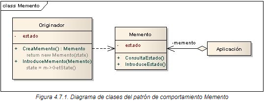

# Patrón de Diseño: Memento

El patrón **Memento** es un patrón de comportamiento que permite capturar y almacenar el estado interno de un objeto sin violar el principio de encapsulación. Este estado puede ser restaurado posteriormente, devolviendo al objeto a su estado anterior.

## Objetivo

El objetivo del patrón Memento es proporcionar una forma de guardar y restaurar el estado de un objeto en un momento determinado sin revelar los detalles de su implementación interna. Es especialmente útil en aplicaciones que requieren la funcionalidad de "deshacer" o "revertir cambios".

## Diagrama de clases


## Estructura
1. **Originator**: La clase cuyo estado interno se desea guardar y restaurar. Crea un memento que contiene su estado y permite restaurarse desde un memento.
2. **Memento**: Objeto que almacena el estado interno del Originator. Solo el Originator puede acceder y manipular el contenido del Memento.
3. **Caretaker**: Clase que solicita la creación de mementos y los utiliza para restaurar el estado del Originator. No debe modificar el contenido de los mementos.

## Ejemplo de Uso

Este patrón es ideal para:
- Sistemas con funcionalidad de "deshacer".
- Aplicaciones que requieren snapshots de un estado complejo para restaurarlo posteriormente.

## Ejecución
Para ejecutar el proyecto, asegúrate de tener configurado Maven y ejecuta los siguientes comandos:
```bash
    mvn clean install
    mvn exec:java

