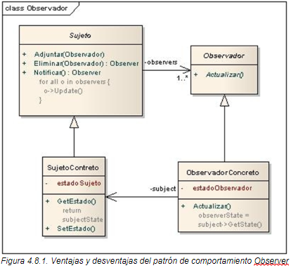

# Patrón de Diseño: Observer

El patrón **Observer** es un patrón de comportamiento que establece una relación de dependencia uno-a-muchos entre objetos. Cuando un objeto cambia su estado, notifica automáticamente a todos sus dependientes (observadores).

## Objetivo

El objetivo del patrón Observer es proporcionar un mecanismo para que múltiples objetos (observadores) estén sincronizados con el estado de un objeto principal (sujeto) sin crear una dependencia rígida entre ellos. Esto fomenta un diseño desacoplado y flexible.

## Diagrama de clases


## Estructura
1. **Subject**: Interfaz o clase que mantiene una lista de observadores. Proporciona métodos para agregar, eliminar y notificar a los observadores.
2. **Observer**: Interfaz o clase abstracta que define el método de actualización, que será llamado cuando el sujeto cambie de estado.
3. **ConcreteSubject**: Implementación concreta del sujeto, que almacena el estado principal y notifica a los observadores de los cambios.
4. **ConcreteObserver**: Implementación concreta del observador, que actualiza su estado en respuesta a las notificaciones del sujeto.

## Ejemplo de Uso

Este patrón es ideal para:
- Sistemas de notificaciones o eventos en tiempo real.
- Implementaciones de publicación-suscripción (pub-sub).
- Interfaces gráficas de usuario que dependen de cambios en el modelo de datos.

## Ejecución
Para ejecutar el proyecto, asegúrate de tener configurado Maven y ejecuta los siguientes comandos:
```bash
    mvn clean install
    mvn exec:java
