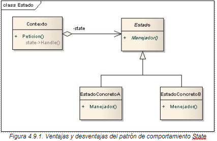

# Patrón de Diseño: State

El patrón **State** es un patrón de comportamiento que permite a un objeto cambiar su comportamiento cuando cambia su estado interno. Es como si el objeto cambiara su clase en tiempo de ejecución.

## Objetivo

El objetivo del patrón State es encapsular los estados posibles de un objeto en clases separadas, de modo que el objeto principal delegue el comportamiento específico a su estado actual. Esto reduce las complejidades de las estructuras condicionales extensas y hace que el código sea más flexible y fácil de mantener.

## Diagrama de clases


## Estructura
1. **Context**: Clase principal que mantiene una referencia al estado actual y delega el comportamiento a los objetos de estado.
2. **State**: Interfaz o clase abstracta que define el comportamiento que deben implementar los estados concretos.
3. **ConcreteState**: Clases que implementan el comportamiento específico de un estado particular del contexto.

## Ejemplo de Uso

Este patrón es ideal para:
- Máquinas de estado finito, como cajeros automáticos o semáforos.
- Aplicaciones que tienen comportamiento variable en función de su estado actual.
- Escenarios donde los estados deben ser fácilmente añadidos, modificados o eliminados sin afectar al resto del sistema.

## Ejecución
Para ejecutar el proyecto, asegúrate de tener configurado Maven y ejecuta los siguientes comandos:
```bash
    mvn clean install
    mvn exec:java
