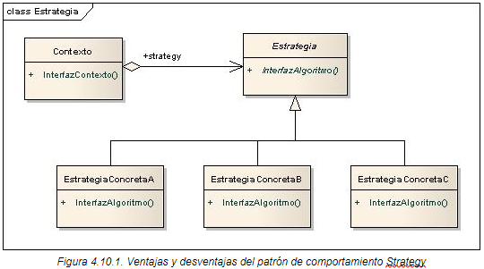

# Patrón de Diseño: Strategy

El patrón **Strategy** es un patrón de comportamiento que permite definir una familia de algoritmos, encapsular cada uno de ellos y hacerlos intercambiables. Este patrón permite que el algoritmo varíe independientemente del cliente que lo utiliza.

## Objetivo

El objetivo del patrón Strategy es proporcionar una manera de seleccionar dinámicamente el algoritmo a usar, delegando esta decisión a objetos específicos que encapsulan el comportamiento. Esto permite evitar estructuras condicionales complejas y fomenta un diseño más flexible y abierto a extensiones.

## Diagrama de clases

## Estructura
1. **Context**: Clase principal que interactúa con los objetos de estrategia y utiliza el algoritmo definido por la estrategia actual.
2. **Strategy**: Interfaz o clase abstract
