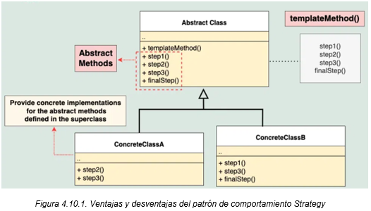

# Patrón de Diseño: Template Method

El patrón **Template Method** es útil para estructurar un algoritmo en una clase base, delegando los detalles de implementación específicos a las subclases. Este enfoque fomenta la reutilización del código, ya que la lógica común permanece en la clase base, mientras que los detalles específicos se implementan en las subclases.
## Objetivo

El objetivo del patrón Template Method es definir el esqueleto de un algoritmo en un método, permitiendo que las subclases implementen algunos pasos del algoritmo sin modificar su estructura general.

## Diagrama de clases


## Estructura
1. **AbstractClass**: Contiene el método plantilla que define la estructura del algoritmo. Este método llama a métodos abstractos y/o concretos que implementan los pasos del algoritmo.
    - Métodos abstractos: Pasos que deben ser implementados por las subclases.
    - Métodos concretos: Pasos comunes que no necesitan ser modificados.
    - Hooks (opcionales): Métodos concretos que pueden ser redefinidos por las subclases.

2. **ConcreteClass**: Implementan los métodos abstractos definidos por la clase abstracta. Cada subclase personaliza los pasos necesarios para adaptarlos a sus necesidades específicas.

## Ejecución
Para ejecutar el proyecto, asegúrate de tener configurado Maven y ejecuta los siguientes comandos:
```bash
    mvn clean install
    mvn exec:java
