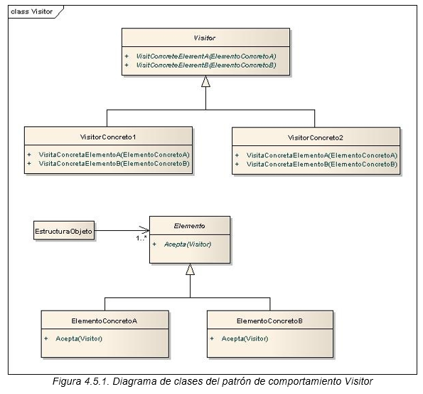

# Patrón de Diseño: Visitor
Este proyecto demuestra la implementación del patrón de diseño **Visitor**. El patrón Visitor permite definir nuevas operaciones en una jerarquía de clases sin cambiar las clases en sí, separando así las operaciones de los elementos sobre los que operan.

## Objetivo
El objetivo del patrón Visitor es permitir la adición de nuevas funcionalidades a una estructura de clases sin modificar sus definiciones. Este patrón es útil para:

- Realizar operaciones sobre una estructura de objetos que puede expandirse sin afectar su diseño original.
- Separar la lógica de las operaciones del código base de las clases sobre las que opera.
- Facilitar la adición de operaciones que deben realizarse en múltiples tipos de objetos.

## Diagrama de clases


## Estructura
1. **Visitor**: Interfaz que declara los métodos de visita para cada tipo de elemento concreto en la estructura.
2. **ConcreteVisitor1** y **ConcreteVisitor2**: Implementaciones específicas de visitantes, que realizan operaciones concretas sobre los elementos de la estructura.
3. **Element**: Interfaz base que declara el método accept para recibir visitantes.
4. **ConcreteElementA** y **ConcreteElementB**: Clases concretas que implementan la interfaz Element y aceptan visitantes.

## Ejecución
Para ejecutar el proyecto, asegúrate de tener configurado Maven y ejecuta los siguientes comandos:
```bash
    mvn clean install
    mvn exec:java
